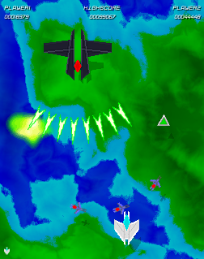
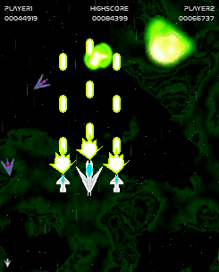
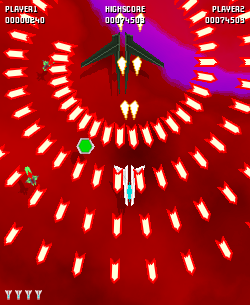

# Attract-Mode-Generator

Create a series of config files for debugging, including: `displays`, `filters`, `emulators`, `layouts`, `romlists`, `favourites`, `tags`, `stats`, `wheels`, and `snaps`.

||||
|:-:|:-:|:-:|
||||

*Example wheel and snap images - regardless of the title, all snaps are shmups!*

```sh
#Name;Title;Emulator;CloneOf;Year;Manufacturer;Category;Players;Rotation;Control;Status;DisplayCount;DisplayType;AltRomname;AltTitle;Extra;Buttons;Series;Language;Region;Rating
sabuga0;Saint Bug Gaiden;Emulator0;;1988;Taico;Puzzle / Digging;2;0;joystick (8-way),joystick (8-way);imperfect;1;raster;;;;6;;English;;
hestcr1;Heavy Street Cross;Emulator0;;1996;Samcom;Sports / Breakout;2;270;joystick (2-way),joystick (2-way);imperfect;1;raster;;;;2;;English;;
neghac2;Neo Ghost Aces (ver 1);Emulator0;;1980;Wilkan;MultiGame / Driving;1;270;joystick (2-way);imperfect;1;raster;;;;5;;Japanese;;
```

*Example romlist - entries are random mashups of popular titles, occasionally the name of a real game pops out!*

## Quickstart

```sh
./generate.exe --output ./example --displays 5 --roms 20 --wheel --snap
```

This creates the `./example` directory and generates config for 5 `displays` with 20 `roms` each, with both `wheel` and `snap` artwork. It should take around 4 seconds to complete and use 10 MB of disk space.

```
/example
    /emulators
    /images
    /layouts
    /romlists
    /stats
```

The resulting directory structure will contain `cfg`, `nut`, `png`, `tag`, `txt`, and `stat` files.

```sh
# <mypath> is the absolute path to the ./example dir
./attract.exe --config "<mypath>/example"
```

Use the `--config` argument to point Attract-Mode at the generated content.

## Usage

```sh
# Show help
./generate.exe -h

# Generate 5 emulators x 20 roms, force-overwrite
./generate.exe -o ./example -d 5 -r 20 -f

# As above plus generate wheel and snap artwork
./generate.exe -o ./example -d 5 -r 20 -f -w -s
```

Press `CTRL + C` to terminate the process at any time.

## Purpose

This is primarily for developers who require a large set of romlists & images for performance testing or debugging, but can also be used as placeholder assets when creating layouts.

While the snap generator is absolutely overkill, some of the images produced can be quite inspiring, and the title generator is downright amusing at times - who wouldn't want to play a few rounds of "Slug Jam", "Fatal Vampire Championship", or "Pyschic Zombie Ace"?

## Further Reading

- [Nuitka - User Documentation](https://nuitka.net/user-documentation/)
- [Github - Nuitka](https://github.com/Nuitka/Nuitka)
- [Github - Nuitka-Action](https://github.com/Nuitka/Nuitka-Action)
- [NumPy - Documentation](https://numpy.org/doc/2.0/)
- [Pillow (PIL Fork) - Documentation](https://pillow.readthedocs.io/en/latest/index.html)
- [1001 Fonts](https://www.1001fonts.com)

All fonts are sourced from "Commercial Free" listings at https://www.1001fonts.com, and are redistributed in their original packaging with disclaimers intact.